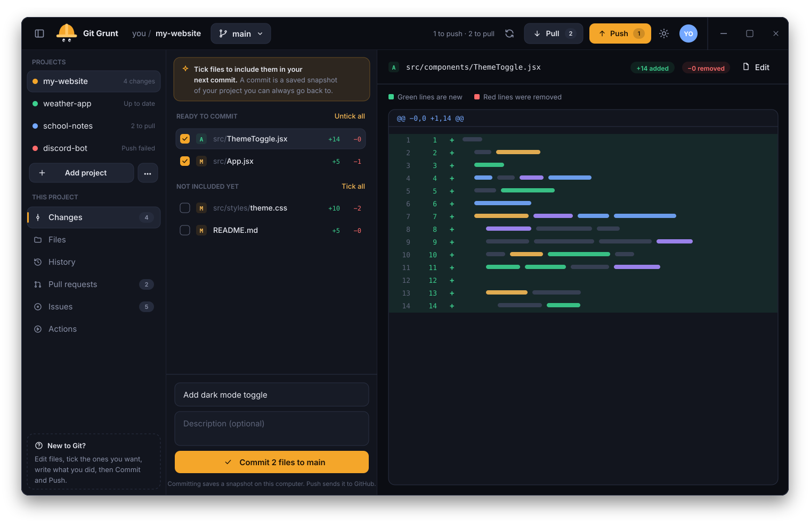
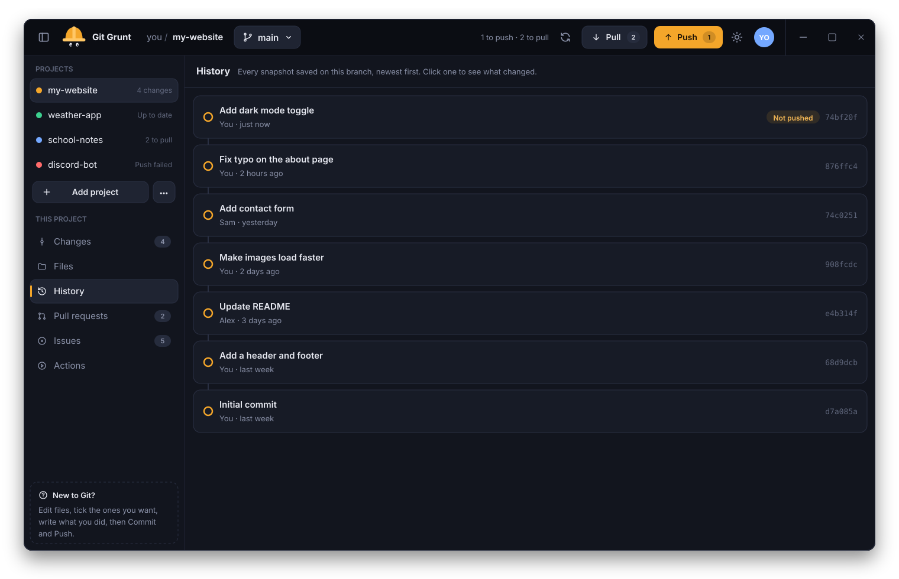
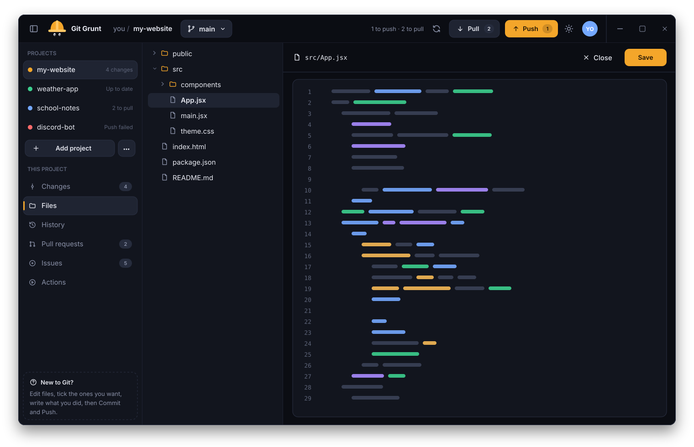
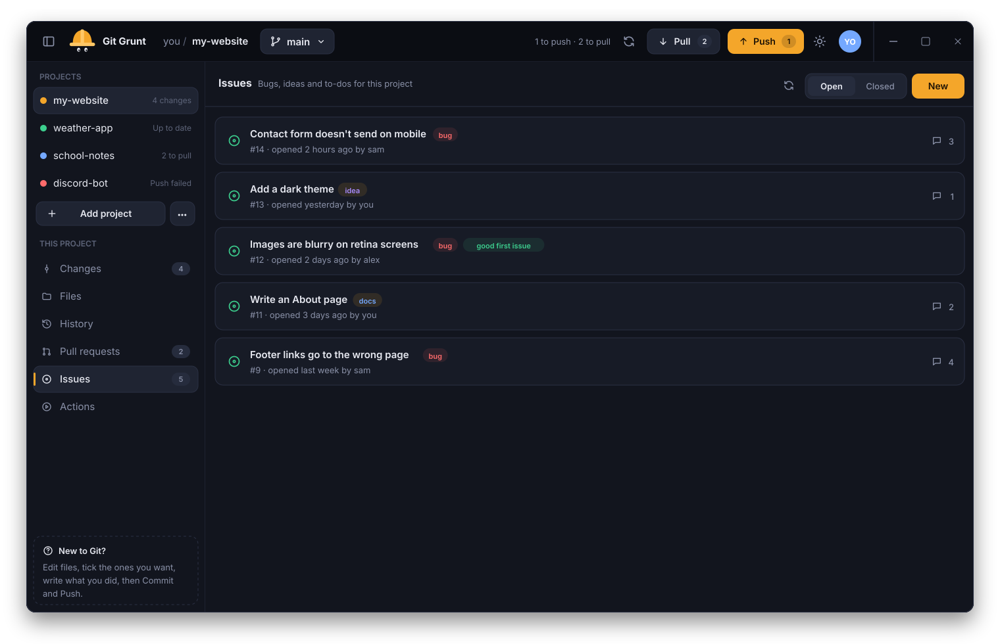
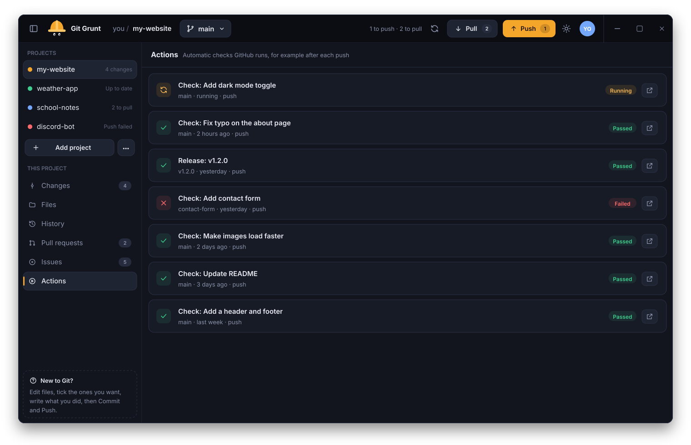
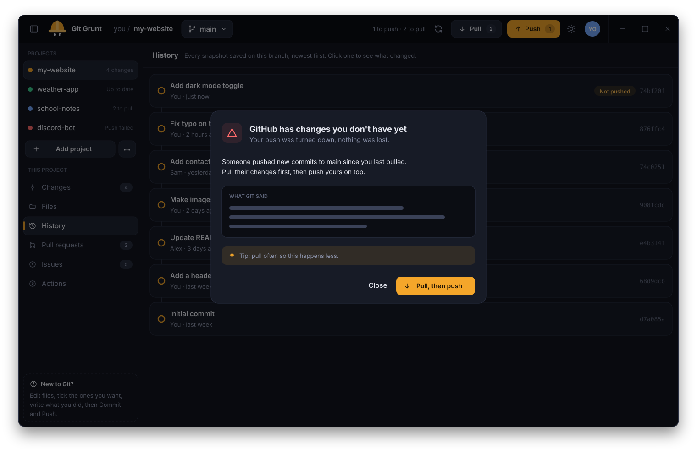

<picture>
  <source media="(prefers-color-scheme: dark)" srcset="docs/assets/banner-dark.svg">
  <source media="(prefers-color-scheme: light)" srcset="docs/assets/banner-light.svg">
  
</picture>

 

**A friendly desktop app for Git and GitHub, made for people who are new to them.** 
Commit, push, pull, switch branches, open pull requests and issues, and check Actions runs, all without the command line.

[**Download**](https://github.com/SSH-Kitty/git-grunt-releases/releases/latest) · [Features](#-features) · [Screenshots](#-screenshots) · [Report a bug](https://github.com/SSH-Kitty/git-grunt-releases/issues)

 

<picture>
  <source media="(prefers-color-scheme: dark)" srcset="docs/screenshots/changes-dark.svg">
  <source media="(prefers-color-scheme: light)" srcset="docs/screenshots/changes-light.svg">
  
</picture>

 

## 👷 Why Git Grunt

Git is powerful, but its error messages assume you already know Git. Git Grunt does the grunt work for you: it shows
what changed in plain colors, tells you what each step does as you go, and when Git reports an error it **explains it
in plain English and offers a one-click fix**.

Under the hood it runs the real `git` and `gh` (GitHub CLI) commands, so everything it does matches the command line
exactly. Nothing is hidden and nothing is locked in.

## ✨ Features

<table>
<tr>
<td width="33%" valign="top">
 
<b>Commit with confidence</b> 
Tick the files you want, write what you did, and save a snapshot. Green lines are new, red lines were removed.
</td>
<td width="33%" valign="top">
 
<b>Push and pull</b> 
See at a glance what's waiting to go up or come down, and sync with GitHub in one click.
</td>
<td width="33%" valign="top">
 
<b>Branches made simple</b> 
Create and switch branches from a menu. When changes clash, Git Grunt walks you through combining them.
</td>
</tr>
<tr>
<td valign="top">
 
<b>Pull requests</b> 
Open pull requests, see their review and check status, and try out their code on your computer.
</td>
<td valign="top">
 
<b>Issues</b> 
Read and write issues with attachments, assignees, labels, projects and milestones. Open and closed views.
</td>
<td valign="top">
 
<b>GitHub Actions</b> 
Watch your checks and release builds run after every push, and open any run on GitHub.
</td>
</tr>
<tr>
<td valign="top">
 
<b>Errors in plain English</b> 
Git's cryptic messages turned into clear help, with a one-click fix for the common ones.
</td>
<td valign="top">
 
<b>Built-in editor</b> 
Browse your project's files and make quick edits with syntax highlighting.
</td>
</tr>
</table>

Plus light and dark themes, a built-in title bar, and an update checker so you're always on the latest version.

## 📸 Screenshots

<table>
<tr>
<td width="50%"><picture><source media="(prefers-color-scheme: light)" srcset="docs/screenshots/history-light.svg"></picture>
<b>History</b>: every snapshot on the branch, newest first
</td>
<td width="50%"><picture><source media="(prefers-color-scheme: light)" srcset="docs/screenshots/files-light.svg"></picture>
<b>Files</b>: browse and edit with syntax highlighting
</td>
</tr>
<tr>
<td width="50%"><picture><source media="(prefers-color-scheme: light)" srcset="docs/screenshots/issues-light.svg"></picture>
<b>Issues</b>: bugs, ideas and to-dos with labels
</td>
<td width="50%"><picture><source media="(prefers-color-scheme: light)" srcset="docs/screenshots/actions-light.svg"></picture>
<b>Actions</b>: checks and builds after each push
</td>
</tr>
<tr>
<td colspan="2"><picture><source media="(prefers-color-scheme: light)" srcset="docs/screenshots/errhelp-light.svg"></picture>
<b>Errors in plain English</b>: what went wrong, and a one-click fix
</td>
</tr>
</table>

## 📦 Install

Grab the installer for your system from the [**Releases**](https://github.com/SSH-Kitty/git-grunt-releases/releases/latest) page:

| System | File |
|--------|------|
| 🐧 Linux | `.AppImage`, `.deb` or `.rpm` |
| 🪟 Windows | `.msi` or `-setup.exe` |
| 🍎 macOS | `.dmg` |

> [!NOTE]
> Builds are unsigned for now, so Windows SmartScreen and macOS Gatekeeper show a warning the first time the app is
> opened.

### Requirements

- [Git](https://git-scm.com/downloads)
- [GitHub CLI](https://cli.github.com) (`gh`). Git Grunt signs you in through it on first launch.

### Updates

Git Grunt checks this page for new versions and offers a one-click update from inside the app.

## 🐞 Feedback

Found a bug or have an idea? [Open an issue](https://github.com/SSH-Kitty/git-grunt-releases/issues). Git Grunt is closed source; this repository hosts the downloads, screenshots and issue tracker.

 

 

