<div align="center">

<picture>
  <source media="(prefers-color-scheme: dark)" srcset="docs/assets/banner-dark.svg">
  <source media="(prefers-color-scheme: light)" srcset="docs/assets/banner-light.svg">
  
</picture>

<br>

[](https://github.com/SSH-Kitty/GIT-Monkey-Releases/releases/latest)


[](https://tauri.app)

**A friendly desktop app for Git and GitHub, made for people who are new to them.**<br>
Edit files, commit, push and pull, switch branches, review pull requests, track issues, publish releases and see what your
team is working on, all without the command line.

<a href="https://github.com/SSH-Kitty/GIT-Monkey-Releases/releases/latest"><b>Download</b></a> ·
<a href="#-install">Install</a> ·
<a href="#-first-run">First run</a> ·
<a href="#-user-guide">User guide</a> ·
<a href="#-keyboard-shortcuts">Shortcuts</a> ·
<a href="#-faq-and-troubleshooting">FAQ</a> ·
<a href="https://github.com/SSH-Kitty/GIT-Monkey-Releases/issues">Report a bug</a>

<br>

<a href="docs/screenshots/changes-dark.png">
<picture>
  <source media="(prefers-color-scheme: dark)" srcset="docs/screenshots/changes-dark.png">
  <source media="(prefers-color-scheme: light)" srcset="docs/screenshots/changes-light.png">
  
</picture>
</a>

</div>

<br>

## 🐒 Why GIT Monkey

Git is powerful, but it assumes you already know Git. GIT Monkey shows what changed in plain colors, explains every
button as you go, and when something goes wrong it **tells you what happened in plain English and offers a one-click
fix**.

Under the hood it runs the real `git` and `gh` (GitHub CLI) commands on your computer, so everything it does matches
the command line exactly. Nothing is hidden and nothing is locked in: your projects stay normal Git repositories that
work with any other tool, and there is no GIT Monkey account or server in between you and GitHub.

## 🧭 How it works

<picture>
  <source media="(prefers-color-scheme: dark)" srcset="docs/assets/workflow-dark.svg">
  <source media="(prefers-color-scheme: light)" srcset="docs/assets/workflow-light.svg">
  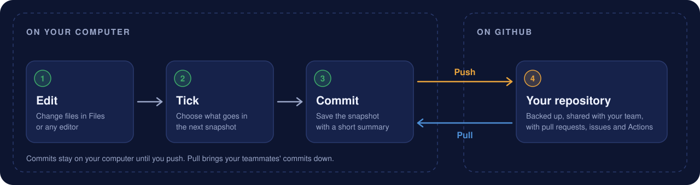
</picture>

That's the whole loop. You **edit** files, **tick** the changes you want to keep together, and **commit** them as a
snapshot with a short summary. Commits are saved on your computer only; **Push** sends them to GitHub, and **Pull**
brings down what your teammates pushed.

<details>
<summary><b>Git words in plain English</b></summary>

<br>

GIT Monkey avoids jargon where it can, but you'll meet these words on GitHub and in tutorials:

| Word | What it means | Where it is in GIT Monkey |
|------|---------------|---------------------------|
| **Repository** (repo) | A project folder whose history Git keeps track of | Each entry under **Projects** in the sidebar |
| **Commit** | A saved snapshot of your files, with a summary of what changed | **Changes** → Commit button |
| **Staging** | Choosing which changes go into the next commit | Ticking files in **Changes** |
| **Push** / **Pull** | Send your commits to GitHub / get other people's commits from it | Buttons in the top bar |
| **Fetch** | Quietly ask GitHub what's new, without changing your files | The refresh button; also automatic |
| **Branch** | A separate line of work, so you can try something without touching `main` | Branch menu in the top bar |
| **Merge** | Combine the commits of one branch into another | "Combine" in the branch menu, or **Merge** on a pull request |
| **Merge conflict** | Two people changed the same lines and Git needs you to choose | Red files in **Changes** |
| **Stash** | Put unfinished changes aside for later | "Put my changes aside" / "Put-aside changes" |
| **Clone** | Download a copy of a GitHub repository | **Add project** → Download from GitHub |
| **Pull request** (PR) | A request to merge a branch, so others can review it first | **Pull requests** |
| **Issue** | A bug report, idea or to-do on GitHub | **Issues** |
| **Actions** | Automatic jobs (tests, builds) that GitHub runs after a push | **Actions** |
| **Release** / **Tag** | A named, finished version of the project, like `v1.0.0` | **Releases** |

</details>

## ✨ Features

<table>
<tr>
<td width="33%" valign="top">
<br>
<b>Files and a built-in editor</b><br>
Browse your project, search inside every file, and edit with syntax highlighting. Copy, paste and delete files right
in the app.
</td>
<td width="33%" valign="top">
<br>
<b>Commit with confidence</b><br>
Tick the files you want, or include just one part of a file. Green lines are new, red lines were removed. Add
co-authors or fix up your last commit.
</td>
<td width="33%" valign="top">
<br>
<b>Push and pull</b><br>
See what's waiting to go up or come down and sync in one click. Undo a pull or a branch switch from the message that
pops up.
</td>
</tr>
<tr>
<td valign="top">
<br>
<b>History you can read</b><br>
Every snapshot with a branch graph. Open one to see what changed, undo it, restore an old version of a file, or start
a branch from it.
</td>
<td valign="top">
<br>
<b>Branches made simple</b><br>
Make, switch, combine, rename and delete branches from one menu. Put changes aside for later and bring them back when
you're ready.
</td>
<td valign="top">
<br>
<b>Pull requests</b><br>
Open pull requests, read the conversation, comment on single lines, see checks and reviews, try the code on your
computer, and merge.
</td>
</tr>
<tr>
<td valign="top">
<br>
<b>Issues</b><br>
Read, write and reply to issues inside the app, with screenshots, assignees, labels, projects and milestones.
</td>
<td valign="top">
<br>
<b>GitHub Actions</b><br>
Watch checks run after every push and get a notification when they finish. When one fails, see why and run it again.
</td>
<td valign="top">
<br>
<b>Releases</b><br>
Publish a new version with notes in a few clicks. GIT Monkey suggests the next version number for you.
</td>
</tr>
<tr>
<td valign="top">
<br>
<b>Work as a team</b><br>
Invite people, group them into GitHub teams, and see who is on which branch and changing which files, live. Get a
heads-up before two people edit the same file.
</td>
<td valign="top">
<br>
<b>Errors in plain English</b><br>
Git's cryptic messages turned into clear help, with a one-click fix for the common ones.
</td>
<td valign="top">
<br>
<b>Safety nets</b><br>
Warns you before a password or API key gets pushed, asks before anything can't be undone, and lets you lock a
project so nothing changes by accident.
</td>
</tr>
</table>

**And more:** light and dark themes with an animated jungle, several GitHub accounts with quick switching, keyboard
shortcuts that match GitHub Desktop, accepting project invites from the sidebar, optional help from Claude, and
built-in updates so you're always on the latest version.

## 📦 Install

### 1. Download GIT Monkey

Get the file for your system from the [**latest release**](https://github.com/SSH-Kitty/GIT-Monkey-Releases/releases/latest):

| System | File | Notes |
|--------|------|-------|
| 🪟 Windows 10/11 | `GIT.Monkey_<version>_x64-setup.exe` or `…_x64_en-US.msi` | Either works. The `.exe` is the usual choice. |
| 🍎 macOS | `GIT.Monkey_<version>_universal.dmg` | One file for both Apple Silicon and Intel Macs. |
| 🐧 Linux (any) | `GIT.Monkey_<version>_amd64.AppImage` | Runs on any distribution, no install needed. |
| 🐧 Debian, Ubuntu, Mint | `GIT.Monkey_<version>_amd64.deb` | `sudo apt install ./GIT.Monkey_*_amd64.deb` |
| 🐧 Fedora, openSUSE | `GIT.Monkey-<version>-1.x86_64.rpm` | `sudo dnf install ./GIT.Monkey-*.x86_64.rpm` |

On Linux, make the AppImage runnable first:

```sh
chmod +x GIT.Monkey_*_amd64.AppImage
./GIT.Monkey_*_amd64.AppImage
```

For a menu entry and icon, open it with [Gear Lever](https://github.com/mijorus/gearlever) or
[AppImageLauncher](https://github.com/TheAssassin/AppImageLauncher), or install the `.deb` / `.rpm` instead.

> [!NOTE]
> Builds aren't code-signed yet, so the first launch shows a warning:
> - **Windows** (SmartScreen): click **More info**, then **Run anyway**.
> - **macOS** (Gatekeeper): right-click the app in Applications, choose **Open**, then **Open** again. If macOS still
>   refuses, go to **System Settings → Privacy & Security** and click **Open Anyway**.

### 2. Install Git and the GitHub CLI

GIT Monkey drives two free tools that do the real work. It checks for both when it starts and tells you what's missing.

| Tool | Windows | macOS | Linux |
|------|---------|-------|-------|
| [Git](https://git-scm.com/downloads) | `winget install --id Git.Git -e` | `xcode-select --install` | `sudo apt install git` (or your package manager) |
| [GitHub CLI](https://cli.github.com) (`gh`) | `winget install --id GitHub.cli -e` | `brew install gh` | see [cli.github.com](https://github.com/cli/cli/blob/trunk/docs/install_linux.md) |

Optional: the [Claude Code](https://claude.com/claude-code) CLI (`claude`) turns on the
[Claude helpers](#claude-optional).

### 3. Staying up to date

GIT Monkey updates itself. The card at the bottom of the sidebar shows your version and checks GitHub for a new one
when the app starts and every 6 hours after. When there is one, click **Update to vX.Y.Z**, read what's new, and
**Update and restart**. Your projects and settings stay as they are.

## 🚀 First run

<a href="docs/screenshots/welcome-dark.png"><picture><source media="(prefers-color-scheme: light)" srcset="docs/screenshots/welcome-light.png"></picture></a>

1. **Open GIT Monkey.** The welcome screen checks that Git and the GitHub CLI are installed. If one is missing it shows
   the command to install it; install it and click **Check again**.
2. **Sign in with GitHub.** Click **Sign in with GitHub**. GIT Monkey shows a short code; click **Open GitHub to enter
   the code**, paste it into the page that opens, and approve. The welcome screen notices by itself when you're done.
   You only do this once: the sign-in is shared with the GitHub CLI, and Git is set up to use it for push and pull too.
3. **Click Get started.** Tick **Don't show this again** to skip the welcome screen next time (you can turn it back on in
   Settings).
4. **Add a project** with the **Add project** button in the sidebar (see [Projects](#projects-and-the-sidebar)).
5. **Make your first commit.** Change a file, open **Changes**, tick it, write a summary like "Fix typo in README", and
   click **Commit**. Then click **Push** in the top bar to send it to GitHub.

> [!TIP]
> If Git doesn't know your name yet, the first commit shows **"Git doesn't know your name yet"** with a
> **Use my GitHub name** button. One click and you're done. You can change it any time in
> [Settings → Commit identity](#settings-and-accounts).

## 📖 User guide

- [Projects and the sidebar](#projects-and-the-sidebar)
- [Changes: committing your work](#changes-committing-your-work)
- [Files: browse, search and edit](#files-browse-search-and-edit)
- [Push, pull and staying in sync](#push-pull-and-staying-in-sync)
- [Branches and put-aside changes](#branches-and-put-aside-changes)
- [History](#history)
- [Pull requests](#pull-requests)
- [Issues](#issues)
- [Actions](#actions)
- [Releases](#releases)
- [Team](#team)
- [When something goes wrong](#when-something-goes-wrong)
- [Safety nets](#safety-nets)
- [Claude (optional)](#claude-optional)
- [Settings and accounts](#settings-and-accounts)

### Projects and the sidebar

<a href="docs/screenshots/addproject-dark.png"><picture><source media="(prefers-color-scheme: light)" srcset="docs/screenshots/addproject-light.png">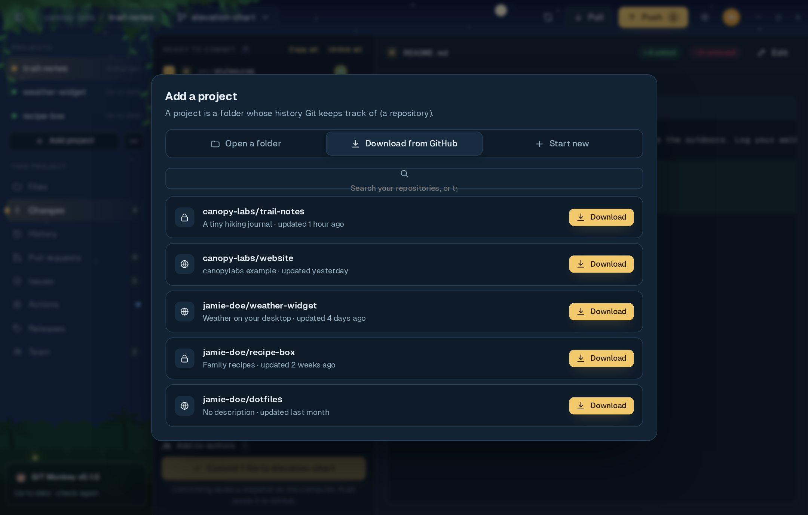</picture></a>

**Add project** gives you three ways in:

- **Open a folder** that's already on your computer. If Git isn't tracking it yet, GIT Monkey offers to **Start
  tracking this folder**. Your files stay exactly as they are.
- **Download from GitHub** (clone). Search your own repositories, or type `owner/name` to download anyone's public one.
- **Start new.** Give it a name and description; GIT Monkey makes the folder with a README and a first commit, and can
  also put it on GitHub as a **private** or **public** repository.

Every project you add is listed under **Projects** with a colored dot: **green** up to date, **yellow** changes or
commits waiting, **blue** new commits to pull, **red** a merge conflict or a folder that's gone missing. Right-click a
project (or use the **⋯** button) to **Lock** it, **Show in folder**, or **Remove from list** (the files stay on your
disk).

Under **This project** are the pages for the open project, each with a shortcut, **Ctrl+1** to **Ctrl+8**: Files,
Changes, History, Pull requests, Issues, Actions, Releases and Team. Numbers next to them count changed files, open
pull requests and issues, and teammates online; a dot on Actions means a run is going (blue) or the last one failed
(red). Hide the sidebar with the button at the top left.

If someone invites you to their repository, an **Invites for you** card appears in the sidebar. **Accept** it and
GIT Monkey offers to download the project right away.

### Changes: committing your work

<a href="docs/screenshots/changes-dark.png"><picture><source media="(prefers-color-scheme: light)" srcset="docs/screenshots/changes-light.png"></picture></a>

Every file you've changed shows up here, whether you edited it in GIT Monkey or in any other editor. Letters tell you
what happened to it: **M** changed, **A** new, **D** deleted, **R** renamed, **U** conflict.

- **Ready to commit** holds the ticked files; **Not included yet** holds the rest. Tick or untick a file (or press
  **Space** on it), or use **Tick all** / **Untick all**.
- Click a file to see its changes on the right: **green lines are new, red lines were removed**, with a count of lines
  added and removed.
- **Include just part of a file.** Each block of changes has an **Include this part** link, so one file can go into
  two separate commits. A half-ticked box means part of the file is included; **Show included parts** switches the view.
- Write a **summary** (required) and an optional **description**, then click **Commit** or press **Ctrl+Enter**. Your
  half-written message is kept if you switch pages.
- **Add co-authors** to credit people you worked with; GitHub shows the commit on their profile too.
- **Add to my last commit** puts the ticked files into your newest commit instead of a new one. It's only offered while
  that commit hasn't been pushed.
- The **⋯** menu on each file can **Open in editor**, **Show in folder**, **Ignore this file** (adds it to
  `.gitignore`), or **Undo my changes** to put it back the way it was.
- After committing, the message that pops up has an **Undo** button. When nothing is left to commit, the list shows the
  commits **Waiting to push**, and the newest one has an **Undo commit** link that puts its changes back.

**Merge conflicts.** When a pull or a merge finds two changes to the same lines, those files turn red and a banner
explains what to do. On each red file use **⋯ → Keep my version** or **Keep their version**, or **Fix by hand in the
editor** and remove the `<<<<<<<` / `>>>>>>>` markers. Tick the file, then **Finish merge**. **Cancel the merge**
puts everything back to how it was before.

### Files: browse, search and edit

<a href="docs/screenshots/files-dark.png"><picture><source media="(prefers-color-scheme: light)" srcset="docs/screenshots/files-light.png"></picture></a>

- A tree of every file in the project, skipping whatever `.gitignore` excludes.
- **Search in files** finds text inside every file. Click a result to jump to that line.
- The editor highlights the syntax of most languages. **Save** with **Ctrl+S**; a dot next to the name means unsaved
  edits, and **Discard edits** throws them away. Windows line endings are kept as they are.
- GIT Monkey won't let unsaved edits slip away: it asks before you switch files and before the window closes.
- Right-click a file or folder to **Copy**, **Paste** (also files copied in your file manager or another project),
  **Delete** (it goes to your system trash, so you can get it back), **Show history** of that one file, or
  **Show in folder**.

### Push, pull and staying in sync

The top bar always shows where you are: the project (and its GitHub owner), the current branch, and the sync buttons.

- **Push** (**Ctrl+P**) sends your commits to GitHub. The badge shows how many are waiting. On a branch that isn't on
  GitHub yet, the first push publishes it.
- **Pull** (**Ctrl+Shift+P**) brings down new commits. The message afterwards has an **Undo** button, and the commits
  are still on GitHub if you change your mind.
- The **refresh** button checks GitHub for new commits without changing your files. GIT Monkey also does this by
  itself when you open a project and when you come back to the window (at most once a minute), so the Pull badge stays
  accurate. You can turn this off in Settings.
- A project that only exists on your computer shows **Publish** instead of Push: it creates a GitHub repository
  (private or public, your choice) and uploads your commits.

### Branches and put-aside changes

<a href="docs/screenshots/branches-dark.png"><picture><source media="(prefers-color-scheme: light)" srcset="docs/screenshots/branches-light.png">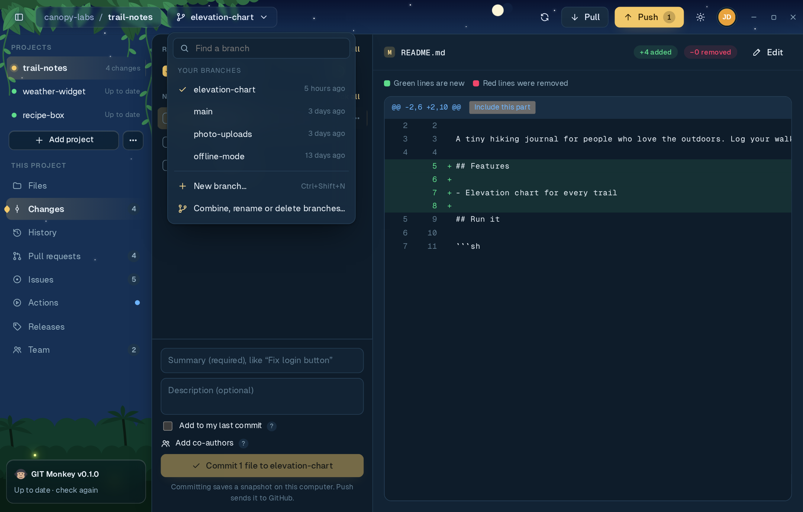</picture></a>

Click the branch name in the top bar (or press **Ctrl+B**) to:

- **Switch** to another branch (type to filter long lists). The message afterwards has an **Undo** that switches back.
- Make a **New branch** (**Ctrl+Shift+N**). Your current, uncommitted changes come along with you.
- **Combine, rename or delete branches**: bring another branch's commits into this one, rename one, or delete one you're
  done with. Deleting only removes the copy on your computer, and you can **Undo** right after. If a branch has commits
  that exist nowhere else, GIT Monkey asks first.
- Bring back **Put-aside changes**. When switching branches would overwrite work you haven't committed, the error
  helper offers **Put my changes aside** (a stash); they wait in this menu until you click them.

### History

<a href="docs/screenshots/history-dark.png"><picture><source media="(prefers-color-scheme: light)" srcset="docs/screenshots/history-light.png"></picture></a>

Every commit on the current branch, newest first, with a graph showing where branches split and joined. Commits that
haven't been pushed yet are marked **Not pushed**. **Find a commit** searches by summary, author or ID, and **Show
older commits** loads more (200 at a time).

<a href="docs/screenshots/commit-dark.png"><picture><source media="(prefers-color-scheme: light)" srcset="docs/screenshots/commit-light.png">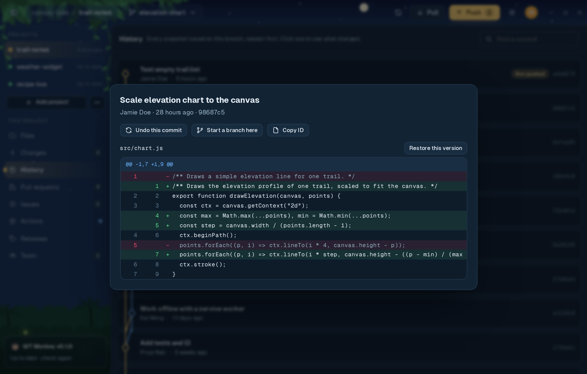</picture></a>

Click a commit to see everything it changed, file by file. From there you can:

- **Undo this commit**: adds a new commit that reverses it. The original stays in the history, so this is safe even
  after pushing.
- **Restore this version** of one file, to get back how it looked at that point.
- **Start a branch here**: try something out from an older snapshot without touching your current branch.
- **Copy ID** of the commit.

### Pull requests

<a href="docs/screenshots/prs-dark.png"><picture><source media="(prefers-color-scheme: light)" srcset="docs/screenshots/prs-light.png"></picture></a>

The list shows each open pull request with its branches, author and badges for **Draft**, **Checks passed / failed /
running**, **Approved**, **Changes requested** and **Needs review**.

- **New pull request** asks to merge your current branch into the main one. If the branch isn't on GitHub yet, it is
  pushed first. (On `main` itself, GIT Monkey explains how to make a branch first.)
- **Try it** switches your computer to a pull request's code, so you can run it before approving.

<a href="docs/screenshots/pr-dark.png"><picture><source media="(prefers-color-scheme: light)" srcset="docs/screenshots/pr-light.png">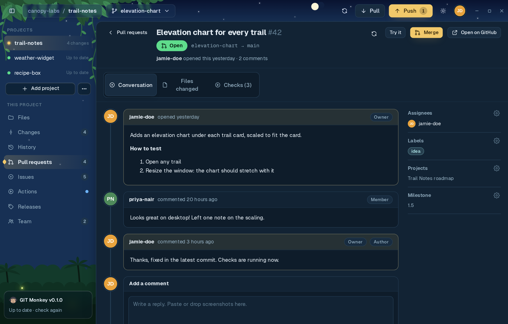</picture></a>

Click a pull request to open it in the app:

- **Conversation**: the description and comments, with assignees, labels, projects and milestone at the side. Reply
  (screenshots can be pasted or dropped in), **Approve**, or **Request changes**.
- **Files changed**: the full diff. Click a line number to **comment on that line** or reply to a thread.
- **Checks**: every automatic check and whether it passed.
- **Merge**: choose **Squash into one commit** (one tidy commit) or **Merge all commits**. The finished branch is
  deleted on GitHub afterwards. Drafts can be marked **Ready for review**, and pull requests can be closed or reopened.

<a href="docs/screenshots/prfiles-dark.png"><picture><source media="(prefers-color-scheme: light)" srcset="docs/screenshots/prfiles-light.png">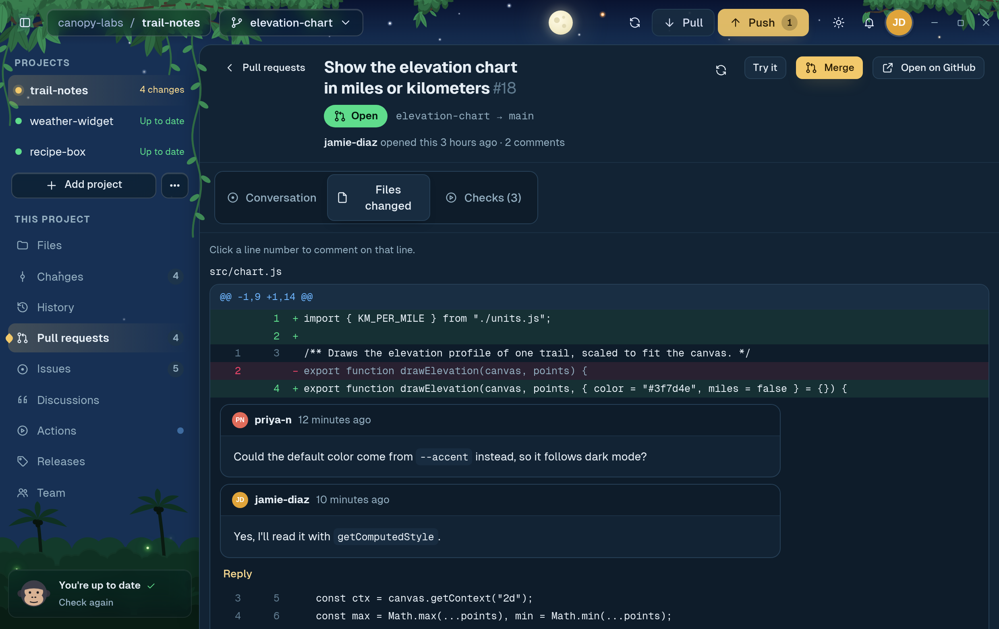</picture></a>

### Issues

<a href="docs/screenshots/issues-dark.png"><picture><source media="(prefers-color-scheme: light)" srcset="docs/screenshots/issues-light.png"></picture></a>

A to-do list for the project: bugs, ideas and questions, with their labels. Switch between **Open** and **Closed**.

<a href="docs/screenshots/newissue-dark.png"><picture><source media="(prefers-color-scheme: light)" srcset="docs/screenshots/newissue-light.png">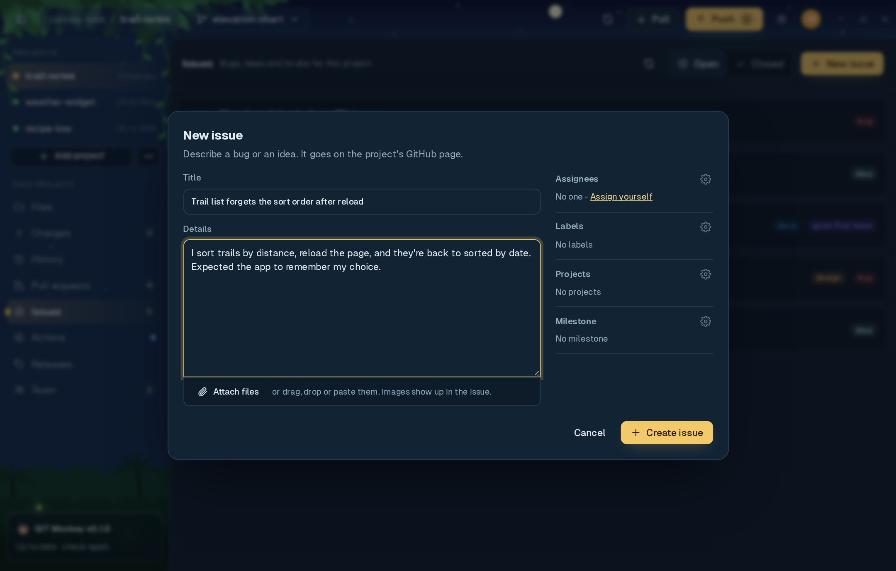</picture></a>

**New issue** opens a form with a title, details, and **attachments**: paste, drop or pick screenshots and files (up
to 25 MB each, GitHub's limit). Set **Assignees**, **Labels**, **Projects** and a **Milestone** on the side. The first
time you use Projects, GIT Monkey asks GitHub for that one extra permission.

<a href="docs/screenshots/issue-dark.png"><picture><source media="(prefers-color-scheme: light)" srcset="docs/screenshots/issue-light.png"></picture></a>

Open an issue to read and reply, edit its title, change its assignees, labels, projects and milestone, and close it
as **completed** ("done, fixed or answered") or **not planned** ("won't fix, duplicate or out of date"), or reopen it.

### Actions

<a href="docs/screenshots/actions-dark.png"><picture><source media="(prefers-color-scheme: light)" srcset="docs/screenshots/actions-light.png"></picture></a>

GitHub Actions are automatic jobs, like tests or builds, set up with workflow files in `.github/workflows`. This page
lists recent runs with their branch, trigger and result, and refreshes by itself while one is running.

After you push, GIT Monkey keeps an eye on the new run and tells you when it's done, with a desktop notification if
you're in another window.

<a href="docs/screenshots/whyfail-dark.png"><picture><source media="(prefers-color-scheme: light)" srcset="docs/screenshots/whyfail-light.png">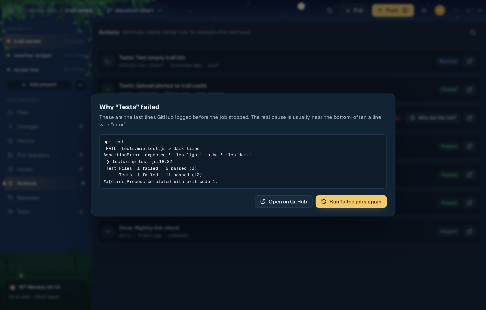</picture></a>

When a run fails, **Why did this fail?** shows the last lines of the log, where the real cause usually is.
**Run failed jobs again** retries just the jobs that failed.

### Releases

<a href="docs/screenshots/releases-dark.png"><picture><source media="(prefers-color-scheme: light)" srcset="docs/screenshots/releases-light.png"></picture></a>

Releases are finished versions people can download, like `v1.0.0`. The list marks the **Latest**, **Draft** and
**Pre-release** ones; click one to open it on GitHub.

<a href="docs/screenshots/newrelease-dark.png"><picture><source media="(prefers-color-scheme: light)" srcset="docs/screenshots/newrelease-light.png">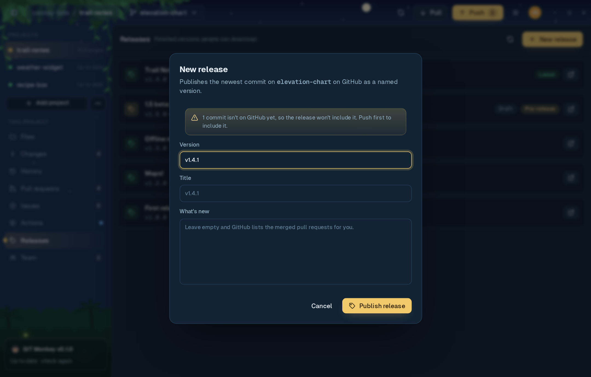</picture></a>

**New release** publishes the newest commit on your branch. The next version number is filled in for you (after
`v1.4.0` comes `v1.4.1`). Write what's new, or leave it empty and GitHub lists the merged pull requests itself. If
you have commits that aren't pushed yet, GIT Monkey warns you that the release won't include them.

### Team

<a href="docs/screenshots/team-dark.png"><picture><source media="(prefers-color-scheme: light)" srcset="docs/screenshots/team-light.png"></picture></a>

**Working now.** Tick **Share what I'm working on** and your teammates see which branch you're on and which files you've
changed, updated within seconds. When someone else is changing a file you're changing too, GIT Monkey warns you, and
shows their picture next to that file in Changes, so you can talk *before* it turns into a merge conflict.

- Only your branch name and the **names** of changed files are shared, never what's in them.
- Sharing is off by default and set per project. On a public repository, GIT Monkey asks first, since anyone could see
  the file names.
- People show as **away** after 5 minutes without an update, and disappear after a day.

**People on this project.** Everyone with access and their role. Admins can **invite** someone by GitHub username as
**Read**, **Write** or **Admin**, cancel invites, and remove people.

**Teams.** For projects that belong to a GitHub organization: make a **New team**, **Add person** to it, and **Give
access** to this project in one go. The first time, GIT Monkey asks GitHub for permission to manage teams. Personal
projects can't have teams; the page explains how to make a free organization.

<details>
<summary>How sharing works behind the scenes</summary>

<br>

There's no GIT Monkey server. Each person's status is stored in the GitHub repository itself, as a small empty commit
under a hidden ref, `refs/gitmonkey/presence/<username>`. Hidden refs don't show up in `git fetch`, on the GitHub
website, or in anyone's history. Turning sharing off deletes your ref straight away. Anyone who can push to the
repository can share.

</details>

### When something goes wrong

<a href="docs/screenshots/errhelp-dark.png"><picture><source media="(prefers-color-scheme: light)" srcset="docs/screenshots/errhelp-light.png"></picture></a>

Instead of Git's raw output, GIT Monkey shows what happened in plain English and, for the common problems, a button
that fixes it. **What Git said** keeps the original message, and **Copy details** copies it for a bug report.

| What you see | What it means | One-click fix |
|--------------|---------------|---------------|
| Git doesn't know your name yet | Commits need a name and email | **Use my GitHub name** |
| Push was rejected | GitHub has commits you don't have yet | **Pull, then push** |
| Nothing to push yet | The project has no commits | **Go to Changes** |
| This branch isn't on GitHub yet | The branch was made on your computer | **Publish branch** |
| Two changes clash (merge conflict) | You and someone else changed the same lines | **Show conflicting files** |
| You have unsaved changes in the way | Switching would throw away uncommitted work | **Put my changes aside** |
| GitHub didn't accept your login | Git isn't connected to your GitHub sign-in | **Connect Git to GitHub** |
| You're not signed in to GitHub | The GitHub CLI is signed out | **Sign in** |
| This folder isn't a Git project yet | Git isn't tracking the folder | **Start tracking this folder** |
| You're looking at an old snapshot | You're on a past commit, not a branch | **Make a branch here** |

It also explains, without a fix button: no access to a repository, repository not found, needing admin rights,
being offline, nothing to commit, and a folder that already exists. For anything else, **Ask Claude** can explain the
error if [Claude is turned on](#claude-optional).

### Safety nets

<a href="docs/screenshots/secrets-dark.png"><picture><source media="(prefers-color-scheme: light)" srcset="docs/screenshots/secrets-light.png">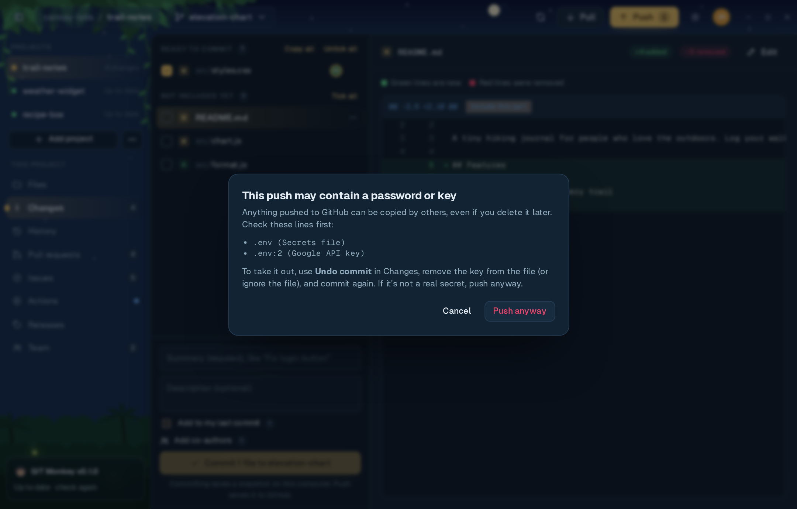</picture></a>

- **Secret check before every push.** GIT Monkey looks through the commits you're about to push for `.env` files,
  private keys (`id_rsa`, `id_ed25519`, `.pem`) and API keys or tokens from AWS, GitHub, Anthropic, OpenAI, Slack and
  Google. If it finds one, it shows the file and line and stops, with steps to take it out. (`.env.example` and similar
  template files are fine.) This catches common mistakes; it isn't a full secret scanner.
- **Undo for everyday actions.** Commit, pull, branch switch, combining branches and deleting a branch all show a
  message with an **Undo** button.
- **Asks before anything permanent**, like throwing away changes or deleting put-aside work, and says plainly when
  something can't be undone.
- **Deleted files go to the trash**, not straight to oblivion.
- **Lock a project** (right-click it in the sidebar) to make it look-only: you can browse, read and review, but nothing
  can be committed, pushed, pulled, edited or deleted until you unlock it.

### Claude (optional)

If you use [Claude Code](https://claude.com/claude-code), GIT Monkey can use it to help. Turn it on in **Settings →
Behavior** ("Use Claude for writing messages and explaining changes"). It's off by default, needs the `claude` CLI to
be installed and signed in, and uses your own Claude account. When it's on, ✨ buttons appear for:

- **Writing a commit message** from your ticked changes.
- **Explain**: what a change does, in plain sentences, on any diff.
- **Change this file**: describe an edit ("add comments", "fix the typo in the title") and Claude rewrites the open file.
  Nothing is saved until you click Save, and **Undo Claude's edit** puts it back.
- **Write with Claude** for pull request descriptions and release notes.
- **Ask Claude** about an error GIT Monkey doesn't recognise.

Only the text needed for each request (the diff, the file or the error) is sent to Claude, and only when you click.

### Settings and accounts

<a href="docs/screenshots/settings-dark.png"><picture><source media="(prefers-color-scheme: light)" srcset="docs/screenshots/settings-light.png">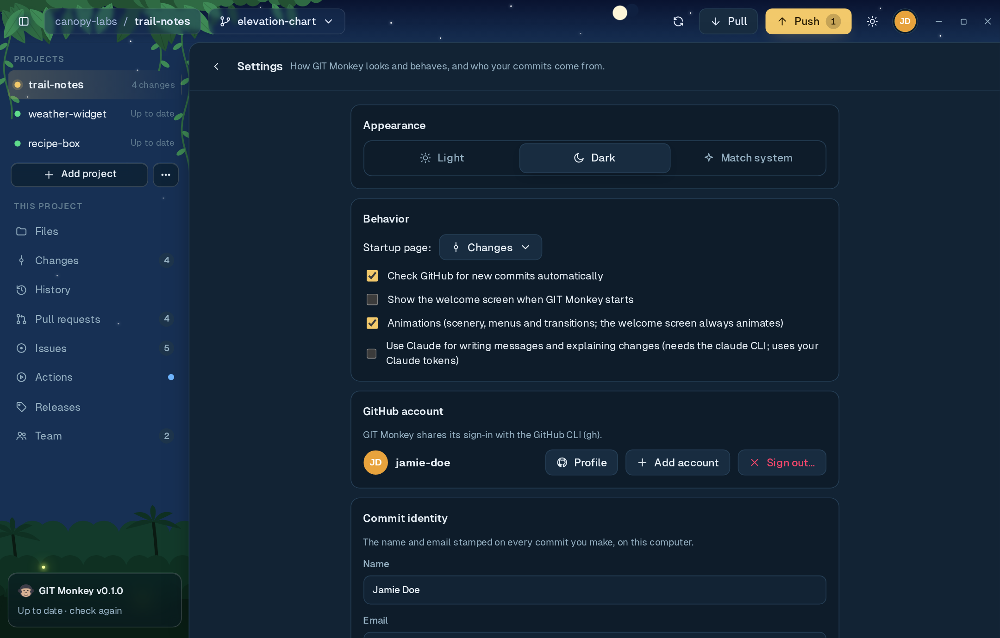</picture></a>

Open Settings with **Ctrl+,** or from your picture in the top right.

- **Appearance**: Light, Dark or Match system. The sun/moon button in the top bar switches quickly.
- **Behavior**: which page projects open on (Files by default), checking GitHub for new commits automatically, showing
  the welcome screen, animations, and Claude.
- **GitHub account**: open your profile, **Add account**, **Switch to** another one, or **Sign out**. GIT Monkey shares
  its sign-in with the GitHub CLI, so signing out here also signs out `gh` in your terminal.
- **Commit identity**: the name and email stamped on your commits on this computer, or **Use my GitHub details** to
  fill them in (with GitHub's private no-reply email).
- **About**: the versions of GIT Monkey, Git and the GitHub CLI.

Several GitHub accounts? Add them all and pick one on the welcome screen ("Who's using GIT Monkey?") or switch from
the account menu. Animations also follow your system's "reduce motion" setting.

## ⚡ Keyboard shortcuts

On macOS, use **Cmd** instead of **Ctrl**. They match GitHub Desktop where it has the same action.

| Shortcut | Action |
|----------|--------|
| **Ctrl+1** … **Ctrl+8** | Files, Changes, History, Pull requests, Issues, Actions, Releases, Team |
| **Ctrl+P** | Push (or Publish) |
| **Ctrl+Shift+P** | Pull |
| **Ctrl+B** | Open the branch menu |
| **Ctrl+Shift+N** | New branch |
| **Ctrl+,** | Settings |
| **Ctrl+Enter** | Commit (in Changes), post a comment (in pull requests) |
| **Ctrl+S** | Save the open file (in Files) |
| **Space** | Tick or untick the focused file (in Changes) |
| **Esc** | Close a dialog or menu, clear a search |

## ❓ FAQ and troubleshooting

<details>
<summary><b>Is GIT Monkey free? Do I need a special account?</b></summary>

<br>Yes, it's free. You only need a GitHub account (also free). There's no GIT Monkey account or server.
</details>

<details>
<summary><b>Does it work with projects I already have?</b></summary>

<br>Yes. Any Git repository works, and anything you do in GIT Monkey shows up in other Git tools and on the command line,
and the other way round. You can stop using GIT Monkey any time.
</details>

<details>
<summary><b>Does it work with GitLab, Bitbucket or GitHub Enterprise?</b></summary>

<br>Committing, branches, history, push and pull work with any Git remote. The GitHub pages (pull requests, issues,
Actions, releases and team) need a repository on github.com.
</details>

<details>
<summary><b>It says Git or the GitHub CLI isn't installed, but I installed it.</b></summary>

<br>Close and reopen GIT Monkey after installing, so it picks up the new program. On Windows, signing out and back in
(or restarting) refreshes the list of installed programs. Then click <b>Check again</b>.
</details>

<details>
<summary><b>Push says "GitHub didn't accept your login".</b></summary>

<br>Click <b>Connect Git to GitHub</b>. It runs <code>gh auth setup-git</code> so Git uses the same sign-in as GIT Monkey.
If the project uses an SSH address (<code>git@github.com:…</code>), your SSH key also has to be added to GitHub.
</details>

<details>
<summary><b>I committed something by mistake.</b></summary>

<br>If it isn't pushed yet: in <b>Changes</b>, click <b>Undo commit</b> on the newest commit under "Waiting to push". Its changes
come back, untouched. If it's already pushed: open it in <b>History</b> and use <b>Undo this commit</b>, which makes a new
commit that reverses it.
</details>

<details>
<summary><b>I pushed a password or key.</b></summary>

<br>Treat it as leaked: <b>change or revoke the key first</b> on the service it belongs to. Removing it from the project
afterwards doesn't take it back out of the history people may have copied.
</details>

<details>
<summary><b>The Changes list is huge and slow.</b></summary>

<br>Folders like <code>node_modules</code>, <code>build</code> or <code>dist</code> usually shouldn't be committed. Add them to a
<code>.gitignore</code> file (or use <b>⋯ → Ignore this file</b>) and they disappear from the list.
</details>

<details>
<summary><b>Where are my settings kept?</b></summary>

<br>Your project list and preferences are stored by GIT Monkey on this computer. Your GitHub sign-in is kept by the
GitHub CLI, and your commit name and email in Git's own settings, so the terminal sees the same ones.
</details>

## 💬 Feedback

Found a bug or have an idea? [Open an issue](https://github.com/SSH-Kitty/GIT-Monkey-Releases/issues). It helps to
include your system, the GIT Monkey version (Settings → About) and, for errors, the text from **Copy details**.

## 🛠 Develop

Built with [Tauri 2](https://tauri.app) (Rust), React and TypeScript.

```sh
npm install
npm run tauri dev          # run the app with live reload
npm run tauri build        # build installers for this computer (src-tauri/target/release/bundle)
```

Checks:

```sh
npx tsc --noEmit                                   # types
node tests/parse.test.ts                           # git output parsers
cargo test --manifest-path src-tauri/Cargo.toml    # error explanations
```

### Release

Push a version tag and GitHub Actions builds installers for all three systems into a draft release:

```sh
git tag v0.1.0 && git push origin v0.1.0
```

Bump `version` in `package.json` and `src-tauri/tauri.conf.json` first.

This repository is private. Users download from the public
[GIT-Monkey-Releases](https://github.com/SSH-Kitty/GIT-Monkey-Releases) repo, which also serves `latest.json` to the
in-app updater. After the draft release builds, publish a release with the same tag there and upload every file from the
draft, including `latest.json` and the `.sig` files. The download links inside `latest.json` point at this private
repo, so fix them before uploading:

```sh
sed -i 's#SSH-Kitty/GIT-Monkey/#SSH-Kitty/GIT-Monkey-Releases/#Ig' latest.json
```

### Layout

| Path | What it does |
|------|--------------|
| `src-tauri/src/lib.rs` | Runs `git` / `gh` / `claude`, sign-in, safe file read/write, clipboard and trash |
| `src-tauri/src/errors.rs` | Turns Git error messages into plain-English help and fix ids |
| `src/api.ts` | Calls into Rust, parses `git status` / `git diff` / `git log`, secret check |
| `src/App.tsx` | Window layout, push/pull, branch menu, error helper, one-click fixes |
| `src/views/` | Changes, Files (editor), History, Pull requests / Issues / Actions / Releases, Team, Settings |
| `src/presence.ts` | Team presence: who is working on which branch and files, shared through GitHub |
| `docs/` | README banner, icons, diagrams and screenshots |
| `mockup/` | The original clickable design mockup |


## 📄 License

GIT Monkey is free to use under its [End User License Agreement](LICENSE). It is not open source.
It includes open-source components; see [third-party notices](THIRD_PARTY_NOTICES.txt).

<br>

<div align="center">
<br>
<sub>GIT Monkey · made with Tauri, React and TypeScript</sub><br>
<sub>Screenshots show a made-up demo project and people. Not affiliated with GitHub.</sub>
</div>
