

<picture>
  <source media="(prefers-color-scheme: dark)" srcset="docs/assets/banner-dark.svg">
  <source media="(prefers-color-scheme: light)" srcset="docs/assets/banner-light.svg">
  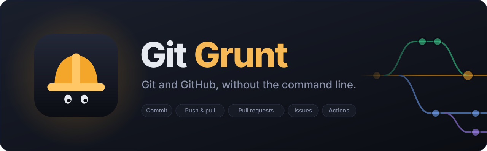
</picture>

 

**A friendly desktop app for Git and GitHub, made for people who are new to them.** 
Edit files, commit, push and pull, switch branches, review pull requests, track issues, publish releases and see what your
team is working on, all without the command line.

[**Download**](https://github.com/SSH-Kitty/GIT-Monkey-Releases/releases/latest) · [Features](#-features) · [Screenshots](#-screenshots) · [Install](#-install) · [Report a bug](https://github.com/SSH-Kitty/GIT-Monkey-Releases/issues)

 

<a href="docs/screenshots/changes-dark.png">
<picture>
  <source media="(prefers-color-scheme: dark)" srcset="docs/screenshots/changes-dark.png">
  <source media="(prefers-color-scheme: light)" srcset="docs/screenshots/changes-light.png">
  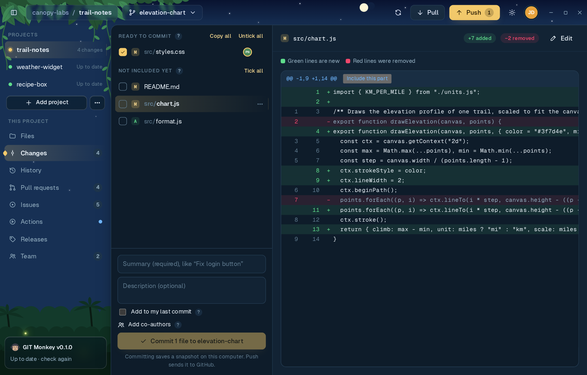
</picture>
</a>

 

## 🐒 Why GIT Monkey

Git is powerful, but it assumes you already know Git. GIT Monkey shows what changed in plain colors, explains every
button as you go, and when something goes wrong it **tells you what happened in plain English and offers a one-click
fix**.

Under the hood it runs the real `git` and `gh` (GitHub CLI) commands, so everything it does matches the command line
exactly. Nothing is hidden and nothing is locked in: your projects stay normal Git repositories.

## ✨ Features

<table>
<tr>
<td width="33%" valign="top">
 
<b>Files and a built-in editor</b> 
Browse your project, search inside every file, and edit with syntax highlighting. Copy, paste and delete files right
in the app.
</td>
<td width="33%" valign="top">
 
<b>Commit with confidence</b> 
Tick the files you want, or include just one part of a file. Green lines are new, red lines were removed. Add
co-authors or fix up your last commit.
</td>
<td width="33%" valign="top">
 
<b>Push and pull</b> 
See what's waiting to go up or come down and sync in one click. Undo a pull or a branch switch from the message that
pops up.
</td>
</tr>
<tr>
<td valign="top">
 
<b>History you can read</b> 
Every snapshot with a branch graph. Open one to see what changed, undo it, restore an old version of a file, or start
a branch from it.
</td>
<td valign="top">
 
<b>Branches made simple</b> 
Make, switch, combine, rename and delete branches from one menu. Put changes aside for later and bring them back when
you're ready.
</td>
<td valign="top">
 
<b>Pull requests</b> 
Open pull requests, read the conversation, comment on single lines, see checks and reviews, try the code on your
computer, and merge.
</td>
</tr>
<tr>
<td valign="top">
 
<b>Issues</b> 
Read, write and reply to issues inside the app, with screenshots, assignees, labels, projects and milestones.
</td>
<td valign="top">
 
<b>GitHub Actions</b> 
Watch checks run after every push and get a notification when they finish. When one fails, see why and run it again.
</td>
<td valign="top">
 
<b>Releases</b> 
Publish a new version with notes in a few clicks. GIT Monkey suggests the next version number for you.
</td>
</tr>
<tr>
<td valign="top">
 
<b>Work as a team</b> 
Invite people, group them into GitHub teams, and see who is on which branch and changing which files, live. Get a
heads-up before two people edit the same file.
</td>
<td valign="top">
 
<b>Errors in plain English</b> 
Git's cryptic messages turned into clear help, with a one-click fix for the common ones.
</td>
<td valign="top">
 
<b>Safety nets</b> 
Warns you before a password or API key gets pushed, asks before anything can't be undone, and lets you lock a
project so nothing changes by accident.
</td>
</tr>
</table>

**And more:** light and dark themes with an animated jungle, several GitHub accounts with quick switching, keyboard
shortcuts that match GitHub Desktop, accepting project invites from the sidebar, and built-in updates so you're always
on the latest version.

## 📸 Screenshots

<table>
<tr>
<td width="50%"><a href="docs/screenshots/welcome-dark.png"><picture><source media="(prefers-color-scheme: light)" srcset="docs/screenshots/welcome-light.png">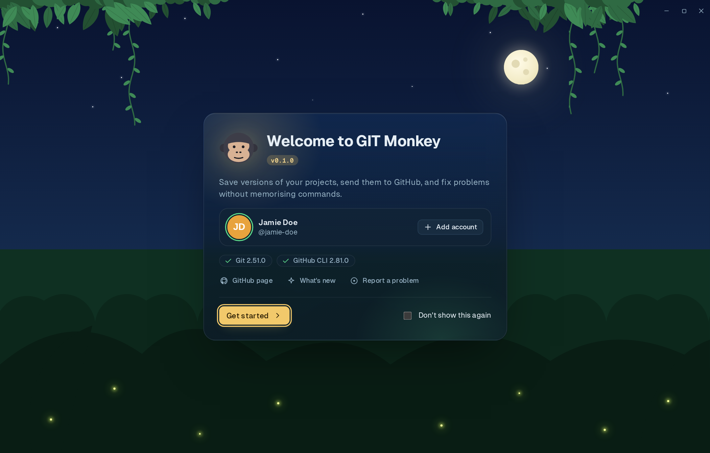</picture></a>
<b>Welcome</b>: checks your setup and signs you in to GitHub
</td>
<td width="50%"><a href="docs/screenshots/team-dark.png"><picture><source media="(prefers-color-scheme: light)" srcset="docs/screenshots/team-light.png">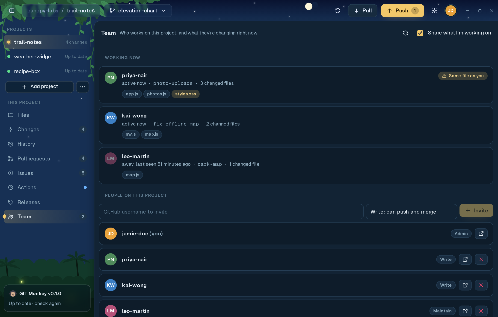</picture></a>
<b>Team</b>: who's working on what, right now
</td>
</tr>
<tr>
<td width="50%"><a href="docs/screenshots/files-dark.png"><picture><source media="(prefers-color-scheme: light)" srcset="docs/screenshots/files-light.png">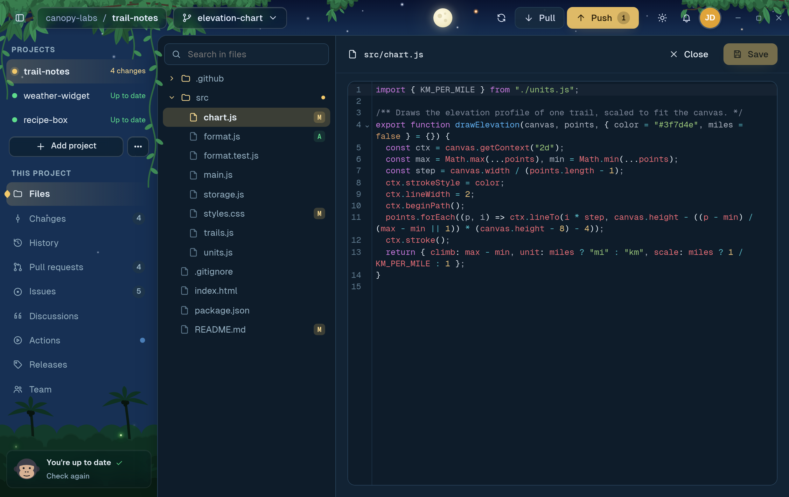</picture></a>
<b>Files</b>: browse, search and edit with syntax highlighting
</td>
<td width="50%"><a href="docs/screenshots/history-dark.png"><picture><source media="(prefers-color-scheme: light)" srcset="docs/screenshots/history-light.png">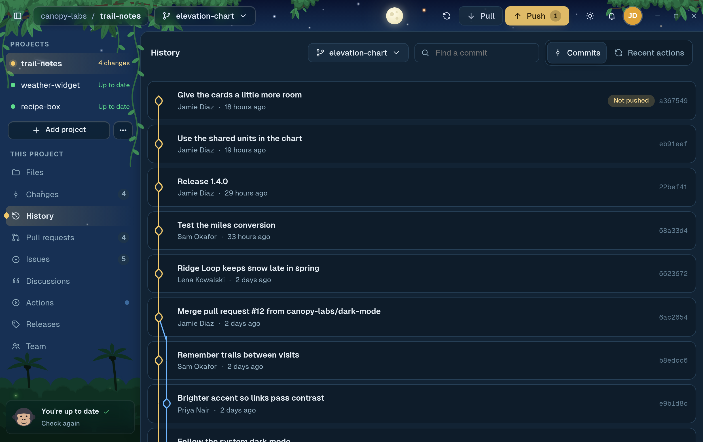</picture></a>
<b>History</b>: every snapshot, with a branch graph
</td>
</tr>
<tr>
<td width="50%"><a href="docs/screenshots/prs-dark.png"><picture><source media="(prefers-color-scheme: light)" srcset="docs/screenshots/prs-light.png">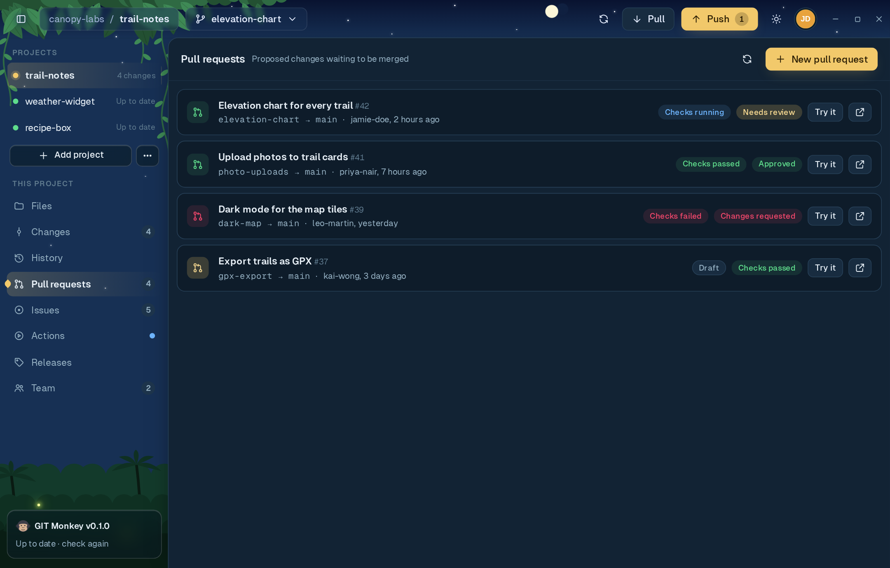</picture></a>
<b>Pull requests</b>: reviews and checks at a glance
</td>
<td width="50%"><a href="docs/screenshots/errhelp-dark.png"><picture><source media="(prefers-color-scheme: light)" srcset="docs/screenshots/errhelp-light.png">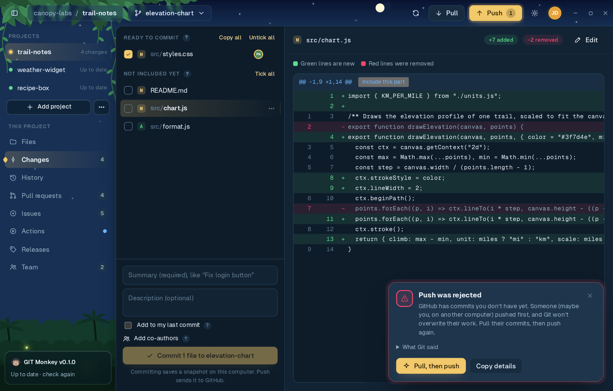</picture></a>
<b>Errors in plain English</b>: what went wrong, and a one-click fix
</td>
</tr>
<tr>
<td width="50%"><a href="docs/screenshots/issue-dark.png"><picture><source media="(prefers-color-scheme: light)" srcset="docs/screenshots/issue-light.png">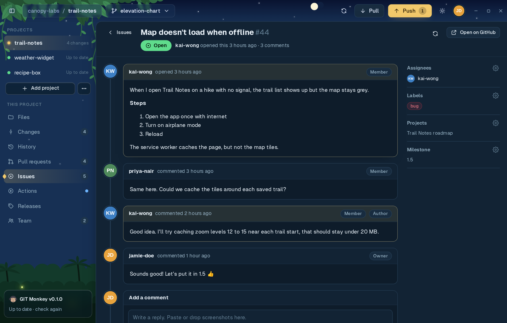</picture></a>
<b>Issues</b>: read and reply without leaving the app
</td>
<td width="50%"><a href="docs/screenshots/actions-dark.png"><picture><source media="(prefers-color-scheme: light)" srcset="docs/screenshots/actions-light.png">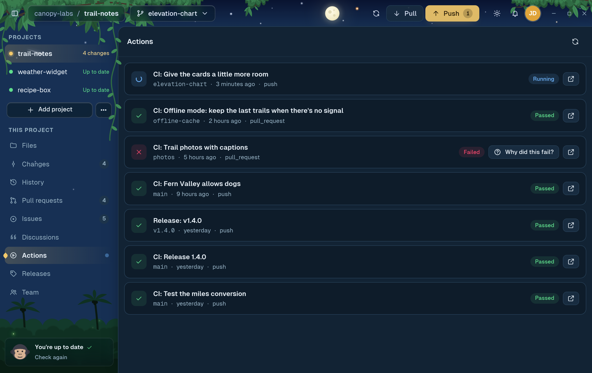</picture></a>
<b>Actions</b>: checks after each push, and why one failed
</td>
</tr>
<tr>
<td width="50%"><a href="docs/screenshots/issues-dark.png"><picture><source media="(prefers-color-scheme: light)" srcset="docs/screenshots/issues-light.png">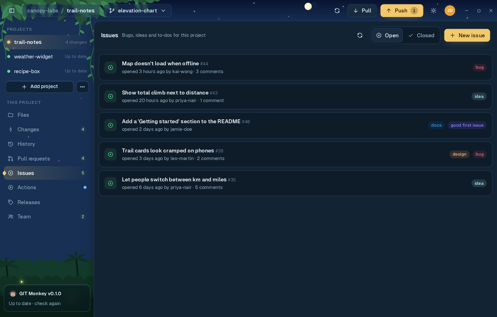</picture></a>
<b>Issues list</b>: bugs, ideas and to-dos with labels
</td>
<td width="50%"><a href="docs/screenshots/releases-dark.png"><picture><source media="(prefers-color-scheme: light)" srcset="docs/screenshots/releases-light.png">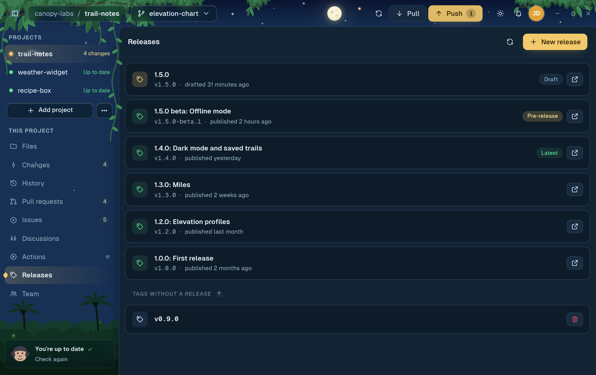</picture></a>
<b>Releases</b>: publish versions people can download
</td>
</tr>
</table>

Click a screenshot to see it full size. Screenshots show a made-up demo project and people.

## 📦 Install

Download the installer for your system from the [**latest release**](https://github.com/SSH-Kitty/GIT-Monkey-Releases/releases/latest):

| System | File |
|--------|------|
| 🐧 Linux | `.AppImage`, `.deb` or `.rpm` |
| 🪟 Windows | `.msi` or `-setup.exe` |
| 🍎 macOS | `.dmg` |

> [!NOTE]
> Builds are unsigned for now, so Windows SmartScreen and macOS Gatekeeper show a warning the first time the app is
> opened. On Windows choose **More info → Run anyway**; on macOS right-click the app and choose **Open**.

After that, GIT Monkey updates itself: when a new version is out, the sidebar offers a one-click update.

### Requirements

- [Git](https://git-scm.com/downloads)
- [GitHub CLI](https://cli.github.com) (`gh`). GIT Monkey checks for both on first launch and signs you in to GitHub
  through it.

## 💬 Feedback

Found a bug or have an idea? [Open an issue](https://github.com/SSH-Kitty/GIT-Monkey-Releases/issues). You can also do
it from inside the app: **Report a problem** on the welcome screen.

 

 
GIT Monkey · made with Tauri, React and TypeScript

