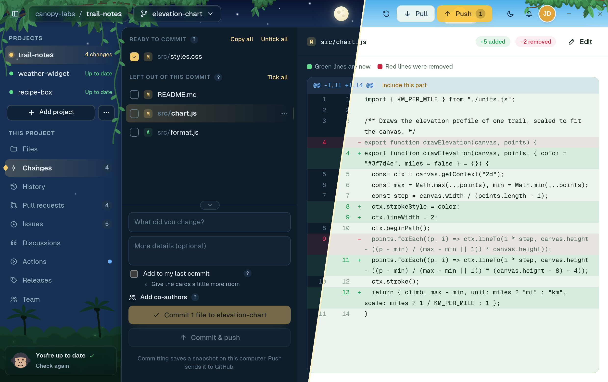
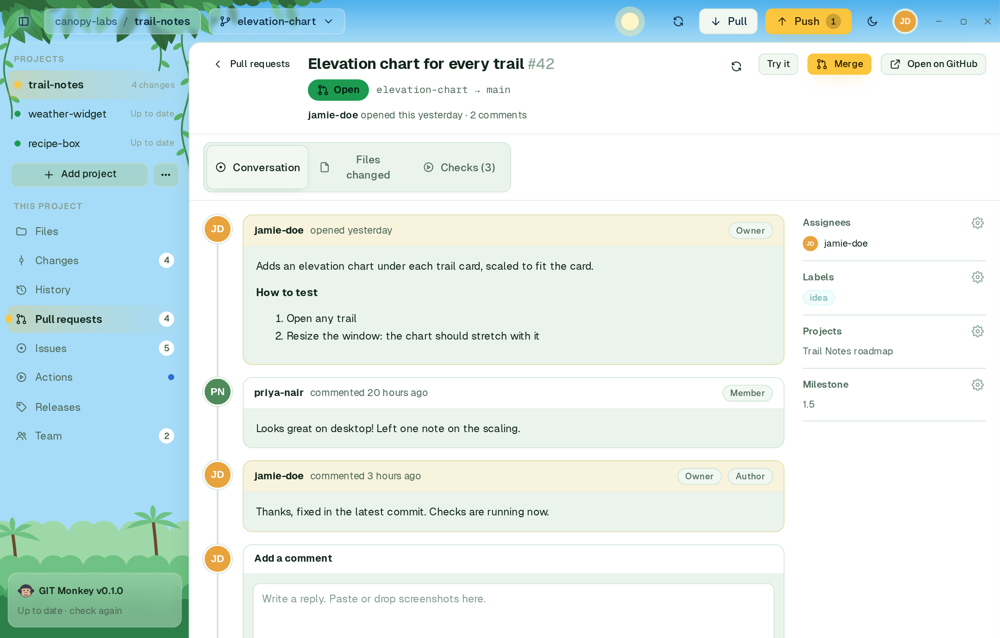
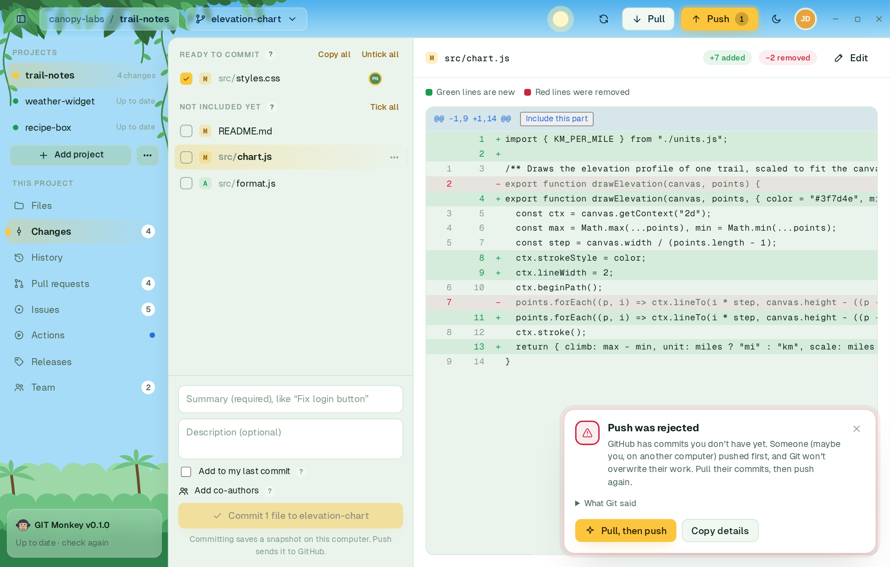

<div align="center">


<br>

<a href="https://github.com/SSH-Kitty/GIT-Monkey-Releases/releases/latest"></a>
<a href="https://github.com/SSH-Kitty/GIT-Monkey-Releases/releases"></a>
<a href="https://github.com/SSH-Kitty/GIT-Monkey-Releases/releases/latest/download/GIT-Monkey-Guide.pdf"></a>
<a href="LICENSE"></a>
<br>
<a href="#1-download-git-monkey"></a>
<a href="#1-download-git-monkey"></a>
<a href="#1-download-git-monkey"></a>
<a href="https://tauri.app"></a>

<a href="https://github.com/SSH-Kitty/GIT-Monkey-Releases/releases/latest/download/GIT-Monkey-Guide.pdf"></a>

### A friendly desktop app for Git and GitHub

Commit, branch, review pull requests and ship releases, all from one window.<br>
Every step is explained in plain English, so you never need the command line.

<a href="https://github.com/SSH-Kitty/GIT-Monkey-Releases/releases/latest"><b>Download</b></a> ·
<a href="https://github.com/SSH-Kitty/GIT-Monkey-Releases/releases/latest/download/GIT-Monkey-Guide.pdf"><b>User guide (PDF)</b></a> ·
<a href="#install">Install</a> ·
<a href="#getting-started">Getting started</a> ·
<a href="https://github.com/SSH-Kitty/GIT-Monkey-Releases/issues">Report a bug</a>

<br>

<a href="docs/screenshots/hero.png"></a>

<sub>Every page comes in a night and a day theme.</sub>

</div>

<br>

## Why GIT Monkey

Git is powerful, but it expects you to already know Git. GIT Monkey is built for everyone else: students, designers,
writers and developers who would rather see their work than memorise commands.

- **See what changed.** Every edit is shown in color, line by line, before you save it.
- **Understand every step.** Buttons say what they do, and a `?` next to anything unfamiliar explains it.
- **Recover from mistakes.** Everyday actions can be undone, and deleted files wait in a Trash for 30 days.
- **Get unstuck fast.** Git errors are explained in plain English, with a one-click fix for the common ones.

It runs the real `git` and `gh` (GitHub CLI) on your computer, so your projects stay ordinary Git repositories that work
with any other tool. There is no GIT Monkey account or server between you and GitHub.

## Features

<table>
<tr>
<td width="33%" valign="top">
<br>
<b>Files and a built-in editor</b><br>
Browse your project, search every file, and edit with syntax highlighting and a formatting toolbar for Markdown.
</td>
<td width="33%" valign="top">
<br>
<b>Commit with confidence</b><br>
Tick whole files or single parts of a file. Green lines are new, red lines are removed. Commit and push in one click.
</td>
<td width="33%" valign="top">
<br>
<b>Push and pull</b><br>
Preview exactly which commits go up or come down, then sync in one click. Undo a pull right after.
</td>
</tr>
<tr>
<td valign="top">
<br>
<b>Readable history</b><br>
Every snapshot on a branch graph. Undo a commit, restore an old file, or start a branch from any point.
</td>
<td valign="top">
<br>
<b>Simple branches</b><br>
Create, switch, combine, rename and delete branches from one menu, and put unfinished work aside.
</td>
<td valign="top">
<br>
<b>Pull requests</b><br>
Read the conversation, comment on single lines, follow checks and reviews, try the code locally, and merge.
</td>
</tr>
<tr>
<td valign="top">
<br>
<b>Issues and discussions</b><br>
Write, reply to and close issues with screenshots, labels and milestones. Ask and answer in Discussions.
</td>
<td valign="top">
<br>
<b>GitHub Actions</b><br>
Watch checks run after every push. When one fails, see why and run it again.
</td>
<td valign="top">
<br>
<b>Releases</b><br>
Publish a version with notes and files in a few clicks. The next version number is suggested for you.
</td>
</tr>
<tr>
<td valign="top">
<br>
<b>Built for teams</b><br>
See who is on which branch and changing which files, live, and get a warning before two people edit the same file.
</td>
<td valign="top">
<br>
<b>Errors in plain English</b><br>
Git's cryptic messages turned into clear explanations, with a one-click fix for the common ones.
</td>
<td valign="top">
<br>
<b>Safety nets</b><br>
A secret check before every push, a Trash for deleted files, project locks and account passcodes.
</td>
</tr>
</table>

**Also included:** a day and a night theme with an animated jungle, Quick Open for any page, project or file, a
notification bell that collects GitHub activity, several GitHub accounts with quick switching, keyboard shortcuts you
can change, signed commits, and automatic updates.

## A closer look

<table>
<tr><td width="50%"><a href="docs/screenshots/team-dark.png"></a><br><sub>Team: who is working on what, live</sub></td><td width="50%"><a href="docs/screenshots/pr-light.png"></a><br><sub>Pull requests: review, comment and merge</sub></td></tr>
<tr><td width="50%"><a href="docs/screenshots/history-dark.png"></a><br><sub>History: every snapshot on a branch graph</sub></td><td width="50%"><a href="docs/screenshots/errhelp-light.png"></a><br><sub>Errors explained, with a one-click fix</sub></td></tr>
</table>

## Install

### 1. Download GIT Monkey

Pick the file for your system from the [**latest release**](https://github.com/SSH-Kitty/GIT-Monkey-Releases/releases/latest).
The **Install GIT Monkey** setup is the easiest option: it installs, updates and removes the app for you.

| System | Recommended | Alternatives |
|--------|-------------|--------------|
| Windows 10/11 | `Install-GIT-Monkey_<version>_x64.exe` | `…_x64-setup.exe`, `…_x64_en-US.msi`, or `…_x64-portable.zip` to run without installing |
| macOS (Apple Silicon and Intel) | `Install-GIT-Monkey_<version>_universal.dmg` | `GIT.Monkey_<version>_universal.dmg` |
| Linux (any distribution) | `Install-GIT-Monkey_<version>_amd64.AppImage` | `…_amd64.AppImage` to run directly |
| Debian, Ubuntu, Mint | | `sudo apt install ./GIT.Monkey_*_amd64.deb` |
| Fedora, openSUSE | | `sudo dnf install ./GIT.Monkey-*.x86_64.rpm` |

To run an AppImage directly, make it executable first:

```sh
chmod +x GIT.Monkey_*_amd64.AppImage
./GIT.Monkey_*_amd64.AppImage
```

> [!NOTE]
> GIT Monkey is not code-signed yet, so the first launch may show a warning. The app is safe to use, and every download
> lists a SHA-256 checksum on GitHub.
> - **Windows** (SmartScreen): click **More info**, then **Run anyway**.
> - **macOS** (Gatekeeper): open **System Settings → Privacy & Security** and click **Open Anyway**. If macOS says the
>   app is damaged, run `xattr -dr com.apple.quarantine "/Applications/GIT Monkey.app"` and open it again.

### 2. Install Git and the GitHub CLI

GIT Monkey relies on two free tools to do the actual work. It checks for both at startup and tells you if either is
missing.

| Tool | Windows | macOS | Linux |
|------|---------|-------|-------|
| [Git](https://git-scm.com/downloads) | `winget install --id Git.Git -e` | `xcode-select --install` | `sudo apt install git` (or your package manager) |
| [GitHub CLI](https://cli.github.com) (`gh`) | `winget install --id GitHub.cli -e` | `brew install gh` | [Installation guide](https://github.com/cli/cli/blob/trunk/docs/install_linux.md) |

### 3. Stay up to date

GIT Monkey updates itself. The card at the bottom of the sidebar shows your version and checks for a new one at
startup and every six hours. When an update is available, click **Update to vX.Y.Z**, review what's new, and choose
**Update and restart**. Your projects and settings are kept.

## Getting started

<a href="docs/screenshots/welcome-light.png"></a>

1. **Open GIT Monkey.** The welcome screen confirms that Git and the GitHub CLI are installed. If one is missing, it
   shows the install command; run it and click **Check again**.
2. **Sign in with GitHub.** Click **Sign in with GitHub**, then **Open GitHub to enter the code**, paste the code shown
   and approve. The welcome screen notices when you're done. You only do this once: the sign-in is shared with the GitHub
   CLI, and Git is set up to use it for push and pull.
3. **Click Get started.** You can skip the welcome screen on later launches in **Settings → Behavior**.
4. **Add a project** with the **Add project** button in the sidebar.
5. **Make your first commit.** Change a file, open **Changes**, tick it, write a summary such as "Fix typo in README",
   and click **Commit**. Then click **Push** to send it to GitHub.

> [!TIP]
> If Git doesn't know your name yet, your first commit shows **"Git doesn't know your name yet"** with a **Use my GitHub
> name** button. One click fixes it, and you can change it later in **Settings → Commit identity**.

## User guide

The **[GIT Monkey Guide (PDF)](https://github.com/SSH-Kitty/GIT-Monkey-Releases/releases/latest/download/GIT-Monkey-Guide.pdf)** walks through every page of the app with screenshots: committing, branches,
history, pull requests, issues, discussions, Actions, releases, the Team page, settings, keyboard shortcuts and an FAQ.

<p align="center"><a href="https://github.com/SSH-Kitty/GIT-Monkey-Releases/releases/latest/download/GIT-Monkey-Guide.pdf"></a></p>

## Feedback

Found a bug or have an idea? [Open an issue](https://github.com/SSH-Kitty/GIT-Monkey-Releases/issues). Please include
your operating system, your GIT Monkey version (**Settings → About**) and, for errors, the text from **Copy details**.

## License

GIT Monkey is free to use under its [End User License Agreement](LICENSE). It is not open source. It includes
open-source components; see the [third-party notices](THIRD_PARTY_NOTICES.txt).

<br>

<div align="center">
<br>
<sub>GIT Monkey · made with Tauri, React and TypeScript</sub><br>
<sub>Screenshots are taken in GIT Monkey with a sample project and fictional team members. Not affiliated with GitHub.</sub>
</div>
